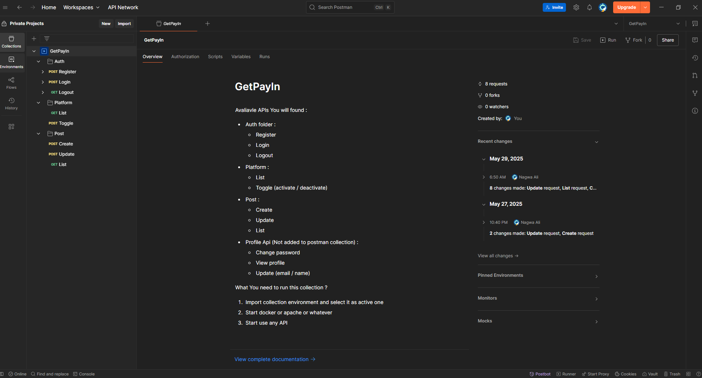
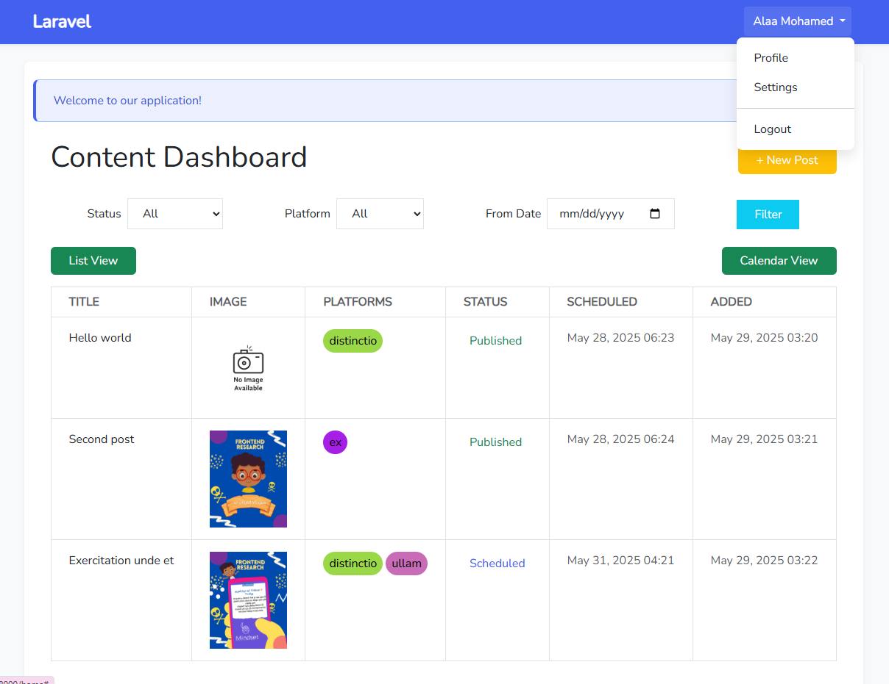
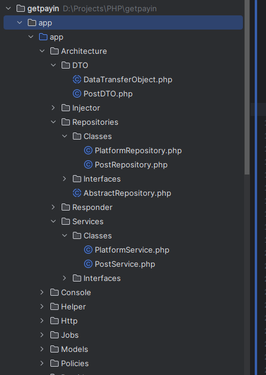

# **Social Media Post Scheduler**
🚀 A **Laravel + Vue.js** application to schedule posts across multiple platforms (Twitter, Facebook, LinkedIn, etc.) with validation rules and user-specific platform restrictions.

## API & Web-based



---


---

## **📂 Project Architecture**




---

## **📌 Features**
✅ **Multi-platform Scheduling** (Twitter, Facebook, LinkedIn, etc.)  
✅ **Character Limit Validation** (Platform-specific rules)  
✅ **User-Specific Platform Restrictions**  
✅ **SweetAlert2 Notifications**  
✅ **Repository-Service Pattern** (Clean architecture)  
✅ **DTOs for Request Validation**

---

## **⚙️ Installation**

### **Option 1: Using XAMPP (Traditional Setup)**

#### **Prerequisites**
- PHP ≥ 8.1
- MySQL
- Composer
- Node.js (for Vue.js)

#### **Steps**
1. **Clone the repo**
   ```bash
   git clone https://github.com/Nagwa138/getpayin-project.git
   cd getpayin-project
   ```

2. **Install dependencies**
   ```bash
   composer install
   npm install
   ```

3. **Configure `.env`**
    - Copy `.env.example` → `.env`
    - Update database credentials:
      ```env
      DB_CONNECTION=mysql
      DB_HOST=127.0.0.1
      DB_PORT=3306
      DB_DATABASE=your_db_name
      DB_USERNAME=your_db_user
      DB_PASSWORD=your_db_password
      ```

4. **Generate keys & migrate**
   ```bash
   php artisan key:generate
   php artisan migrate --seed
   ```

5. **Build assets**
   ```bash
   npm run dev  # For development
   npm run build  # For production
   ```

6. **Run the app**
   ```bash
   php artisan serve
   ```
   Open: [http://localhost:8000](http://localhost:8000)

---

### **Option 2: Using Docker (Simplified Setup)**

#### **Prerequisites**
- Docker + Docker Compose

#### **Steps**
1. **Clone the repo**
   ```bash
   git clone https://github.com/yourusername/social-media-scheduler.git
   cd social-media-scheduler
   ```

2. **Run Docker**
   ```bash
   docker-compose up -d
   ```

3. **Install dependencies**
   ```bash
   docker-compose exec app bash
   ```

4. **Configure `.env`**
   ```bash
   cp .env.example .env
   ```
   No need to change DB settings—Docker handles it!

5. **Generate keys & migrate**
   ```bash
   php artisan key:generate
   php artisan migrate --seed
   ```

6. **Build assets**
   ```bash
   npm run dev
   ```

7. **Access the app**  
   Open: [http://localhost/2345](http://localhost/2345)

---

## **🔧 Usage**
1. **Login/Register**
    - Default test user:
      ```
      Email: test@example.com  
      Password: password  
      ```

2. **Schedule a Post**
    - Go to **"Create Post"**
    - Select platforms, set schedule time, and submit.

3. **Manage Platforms**
    - Admins can toggle platform availability in **Settings → Platforms**.

4. **View Scheduled Posts**
    - Check the calendar view for scheduled posts.

---

## **📂 Project Structure**
```
app/
├── Http/Controllers/PostController.php  # Post logic
├── Services/PostService.php             # Business logic
├── Repositories/PlatformRepository.php  # DB interactions
resources/
├── js/components/                       # Vue.js components
├── views/posts/create.blade.php         # Post creation form
```

## **🚀 Deployment**
- **For Production**:
  ```bash
  npm run build
  php artisan optimize
  ```

---
